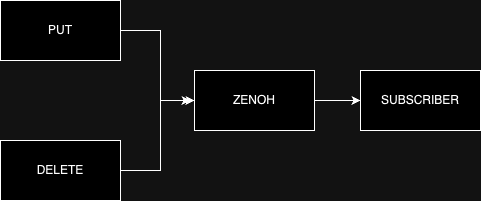
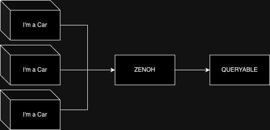

# Zenoh Demo
Zenoh is a pub/sub _and_ query protocol, easy to set up and to use. It claims to be extremely performant and energy efficient as well.

## Interactions

### Subscriber flow
The **Subscriber** is capable to listen to changes made through **PUT** and **DELETE** operations on a given key expression.

### Queryable flow
The **Queryable** flow is capable of listening to **GET** requests coming on a given key expression and **_to reply to them_**.

## Considerations

### Pros
- Easy to use
- Both Peer to Peer and Client modes
- Plugin support for the Zenohd server - [See docs](https://zenoh.io/docs/manual/plugins/)
- Better performances than MQTT and CycloneDDS - [See blog](https://zenoh.io/blog/2023-03-21-zenoh-vs-mqtt-kafka-dds/)
- Adopted by Eclipse SDV foundation, might lead to great adoption in automotive industry

### Cons
- Extremely green - [1.0.0 release was expected for April 22nd](https://github.com/orgs/eclipse-zenoh/projects/9?pane=issue&itemId=51047701), but it's been delayed
- As such, there is a lack of support from the common frameworks (Spring, Quarkus, etc...)
- Missing features as MQTT Shared Subscription and Kafka's Consumer Group, making it hard to scale horizontally the subscribers

## Use cases
Just as for MQTT, the main use case is IoT, so anything from smart homes to city sensors can make use of it. 
As it is part of the SDV project, the main goal is to use this protocol inside of vehicles in order to share their data.

